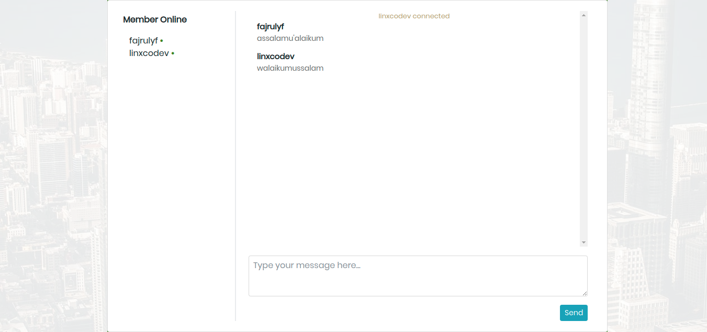

## NodeChat
Aplikasi chat menggunakan express js dan socket io

## List Fiture
- Login chatroom
- Validasi require username
- Validasi unique username
- Detect user typing
- Notification to another user when user is conected in chat
- Notification to another user when user is disconected in chat
- List user connected

## Instalation
**Cloning**
```
git clone https://github.com/linxcodev/node-chat.git
cd node-chat
yarn install
```

**Running Server**
```
node server.js
```

## Login


## Chatroom

